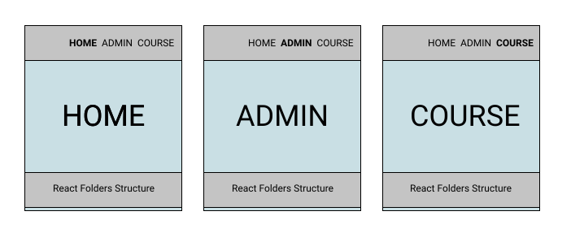
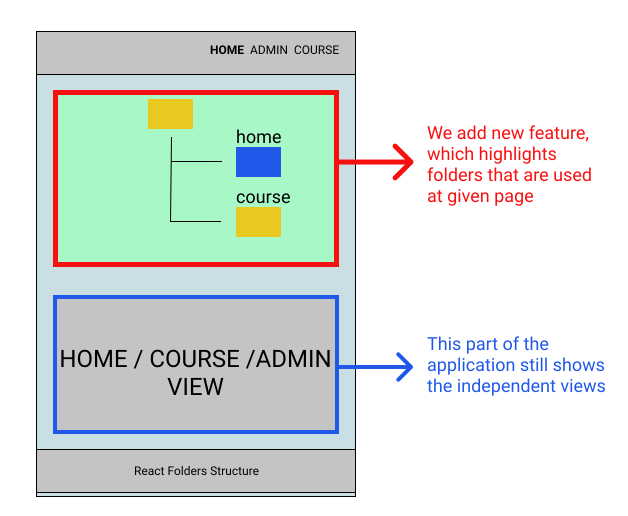

W tym wpisie chciałem podzielić się moją mocno zopiniowaną i subiektywną strukturę folderów aplikacji Reactowej. W dalszej części postaram się przedstawić argumenty i ścieżkę, która doprowadziła mnie do takiej architektury. 

<a href="#start-small">1. Zacznij prosto!</a>
<a href="#lets-complicate">2. Komplikujemy</a>
<a href="#app-and-shared">3. Foldery app i shared</a>

```md
src
├── config
│   └── routes.ts
│── app
│   ├── admin
│   │   ├── components
│   │   │   ├── reports
│   │   │   │   ├── components
│   │   │   │   ├── api
│   │   │   │   │   ├── getReports.ts
│   │   │   │   │   └── deleteReports.ts
│   │   │   │   ├── stores
│   │   │   │   │   └── ReportsStore.tsx
│   │   │   │   └── Reports.tsx
│   │   │   └── users
│   │   │       ├── components
│   │   │       └── Users.tsx
│   │   ├── shared
│   │   │   ├── adminButton
│   │   │   └── stores
│   │   │       ├── AccountStore.tsx 
│   │   │       └── UserStore.tsx
│   │   └── Admin.tsx
│   └── course
│   │   ├── components
│   │   │   └── assignments
│   │   │       ├── components
│   │   │       └── Assignments.tsx
│   │   ├── Course.tsx
│   │   ├── Course.container.tsx  
│   │   └── Course.module.css
│   ├── App.tsx
│   ├── AppProviders.tsx
│   ├── AppRoutes.tsx
│   ├── App.module.css
│   └── App.spec.tsx
|
├── shared
│   ├── util
│   │   └── createStore.ts
│   ├── api
│   │   └── apiWrapper.ts
│   ├── components
│   │   ├── Header
│   │   ├── Footer
│   │   └── Container
|   ├── captcha   
|   |   └── CaptchaProvider.tsx
│   └── store
│       └── AppStore 
└── index.tsx

```
<h2 id="start-small">Zacznij prosto!</h2>
<i>Start small but keep in mind where the app is heading down the road. - Angular Docs</i> 

Przeanalizujmy aplikację, którą będziemy rozwijać:



Do zaimplementowania są:
 * 3 widoki, każdy pod osobnym routem: Home, Admin, Courese,
 * 3 współdzielone komponenty: Header, Footer i Container.

Na co możemy zwrócić uwagę już na tym etapie:

* punktem wejściowym w aplikacjach Reactowych zwykło się przyjmować plik <i>index.tsx (1)</i>

```md
src
│── app
│   └── App.tsx
└── index.tsx  (1)
```

 a jego jedynym zadaniem jest wyrenderowanie aplikacji:

```tsx
ReactDOM.render(<App />, document.getElementById('root'));
```

* folder <i>app (2)</i> - pełni rolę zbiorczą dla całości a dzięki umieszczeniu komponentów w osobnych folderach od razu widać, że główny plik to <i>App.tsx (3)</i>:

```md
src
│── app  (2)
│   ├── home
│   ├── admin
│   ├── course
│   ├── header
│   ├── footer
│   └── App.tsx (3)
└── index.tsx  (1)
```

* w tak prostej strukturze plik <i>App.tsx (3)</i> jest odpowiedzialny za całą logikę wyświetlania odpowiednich komponentów w zależności od adresu URL:

```tsx
// app/App.tsx

export default function App() {
  return (
    <>
      <Router>
        <Header />
        <Container>
            <Switch>
              <Route path={Routes.Admin}>
                <Admin />
              </Route>
              <Route path={Routes.Course}>
                <Course />
              </Route>
              <Route path={Routes.Home}>
                <Home />
              </Route>
            </Switch>
        </Container>
      </Router>
      <Footer />
    </>
  );
}
```

* dość powszechą regułą jest, że jeśli dany plik zwraca komponent JSX, to jego nazwa powinna być zapisana z dużej litery, nie będzie tu odstępstw:

```md
├── admin
|    ├── Admin.test.tsx
|    ├── Admin.module.css
|    └── Admin.tsx
├── course
|    └── Course.tsx
```

Również nazwy pozostałych plików (css i testów) powinny być zapisane w ten sam sposób co plik główny.

* jeśli w komponencie chcemy wydzielić powtarzalne elementy do osobnych komponentów, struktura na przykładzie <i>Headera</i> wyglądałaby tak:

```md
├── header (4)
|    ├── link (4.1)
|    |    └── HeaderLink.tsx
|    └── Header.tsx
```
Chciałbym zwrócić w tym miejscu uwagę na pewną kwestię nazewniczą. W folderze <i>header (4)</i> znajduje się plik <i>Header.tsx</i> jednak już w folderze <i>link (4.1)</i> komponent został nazwany dwuczłonowo, wydaje się to niespójne. Jest jednak nieco inaczej:

<ol>
<li>
nazywanie folderów zagnieżdżonych z przedrostkiem "rodzica" powoduje zbędny szum. Ponieważ przyjęto założenie, że w danym folderze znajdują się tylko komponenty dzieci danego modułu - nazywanie folderów: <i>header/headerLink</i> jest nadmiarowe,
</li>
<li>
natomiast nazwa pliku powinna być w obrębie całego projektu możliwie unikatowa i niepowtarzalna, ułatwia to nawigację z poziomu IDE oraz nie powoduje problemów z autoimportami.
</li>
</ol>

Inny przykład:
```md
card 
├── title
|    └── CardTitle.tsx
├── button
|    └── CardButton.tsx
├── image
|    ├── icon
|    |   └── CardImageIcon.tsx
|    └── CardImage.tsx
└── Card.tsx
```
Taka konwencja pozwoli nam zachować spójność i wizualną czystość.

* mając na uwadzę bardzo ważną zasadę aby nigdy nic nie exportować z pliku <i>App.tsx (2)</i> poza samym komponentem - dodajemy osobny plik z routami w <i>config/routes.ts</i>:

```md
├── config (5)
│   └── routes.ts
```

Zarówno nazwa folderu <i>config</i> jak i plików jest dobrowolna. Mocno wynika ona ze specyfiki danego projektu, dlatego nie przywiązujmy do niej dużej uwagi.

Na ten moment struktura naszej bardzo bardzo prostej i naiwnej aplikacji wygląda tak:

```md
src
├── config (5)
│   └── routes.ts
│── app  (2)
│   ├── home
│   ├── admin
│   ├── course
│   ├── header  (4)
│   ├── footer
│   └── App.tsx  (3)
└── index.tsx  (1)
```


<h2 id="lets-complicate">Komplikujemy</h2>

Dodajmy do naszej aplikacji nową funkcjonalność  polegającą na wyświetlaniu struktury folderów, ( tych z których korzysta dany widok) w postaci drzewa katalogów. Ten współdzielony komponent - będzie się wyświetlać na każdej stronie i w zależności od aktualnego widoku będzie aktualizować swój stan i podświetlać inne foldery oraz pliki.



Dodajemy więc nowy folder i nazwijmy go <i>tree (1)</i>

```md
src
├── config
│   └── routes.ts
│── app  
│   ├── home
│   ├── admin
│   ├── course
│   ├── header
│   ├── footer
│   ├── tree  (1)
│   └── App.tsx
└── index.tsx
```

będą się na niego składać context, reducer i komponent UI. Przyjrzyjmy się pierwszej propozycji "per feature":

```md
// struktura "per feature"

tree
├── viewer
|    └── TreeViewer.tsx
├── reducer
│   ├── treeReducer.test.ts
│   └── treeReducer.ts
└── TreeContext.tsx
```

i zatrzymajmy się tu na moment, ponieważ takie podejście mimo, że bardzo logiczne wbrew pozorom nie jest aż tak oczywiste jakby się mogło wydawać. Właśnie zamknęliśmy całą nową funkcjonalność w jednym folderze. Dla rozróżnienia spójrzmy na przeciwstawną koncepcję, promowaną swego czasu przez niektórych użytkowników <i>reduxa</i>:

```md
// struktura "per file type"

│── components
|   └── treeViewer
|       └── TreeViewer.tsx
├── store
│   ├── reducer
│   │   ├── treeReducer.test.ts
│   │   └── treeReducer.ts
│   └── context
|       └── TreeContext.tsx
```

Chyba już na pierwszy rzut oka widać przewagę podejścia "per feature" nad podejściem "per file type". Jednak gdyby ktoś miał wątpliwości, postaram się wypunktować te zalety, które ja osobiście dostrzegam:

<ol>
 <li>nawigacją po płaskiej strukturze folderów w stylu: <i>reducer, store, action, components</i> będzie nieco mniej intuicyjna niż posiadanie jednego katalogu,</li> 
 <li>wraz z dodawaniem kolejnych reducerów, akcji i contextów zajmuje to jeszcze więcej czasu,</li> 
 <li>podejście "per feature" pozwala szybciej ocenić poziom skomplikowania danej funkcjonalności chociazby na podstawie ilości folderów,</li>
 <li>mniej generyczne nazewnictwo oddziałuje lepiej na naszą percepcję i skile poznawcze</li>
 </ol> 

No ok, to już wiemy jak budować strukturę plików wokół "ficzerów" ale co z architekturą całości? Nadal tkwimy ze wszystkimi folderami w jednym miejscu, w <i>app</i>.

<h2 id="app-and-shared">Foldery app i shared</h2>

O ile podział na którym się zatrzymaliśmy jest jak najbardziej sensowny i sprawdza się w praktyce przy mniejszych projektach (np. komponentów w architekturze mikro-frontendowej) o tyle, no właśnie, już przy nieco większych taka struktura zaczyna być problematyczna. Przekonajmy się dlaczego.

<h2 id="sources">Źródła</h2>

</br>

[Choosing a highly scalable folder structure in angular](https://itnext.io/choosing-a-highly-scalable-folder-structure-in-angular-d987de65ec7)

